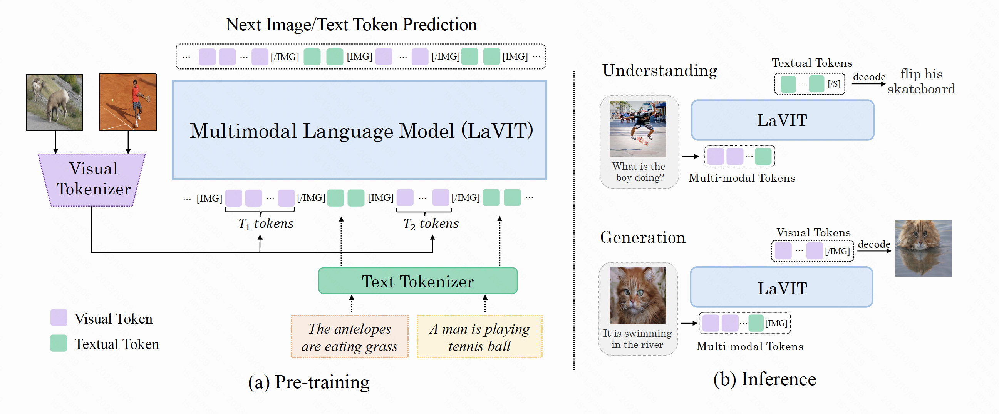
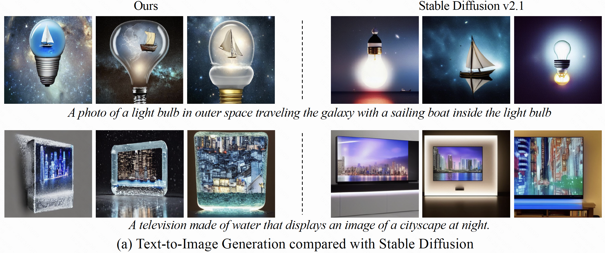

# LaVIT: Unified Language-Vision Pretraining in LLM with Dynamic Discrete Visual Tokenization
This is the official repository for the multi-modal large language model: **LaVIT**.

[[`arXiv`](https://arxiv.org/abs/2309.04669)] [[`BibTeX`](#Citing)]

## News and Updates
* ```2023.10.17``` 🚀🚀🚀  We release the pre-trained weight for **LaVIT** on the HuggingFace and provide the inference code of using it for both multi-modal understanding and generation.

## Introduction
We propose **LaVIT**, a new general-purpose multi-modal foundation model that inherits the successful learning paradigm of LLM: predicting the next image / text token in an auto-regressive manner. LaVIT introduces a well-designed visual tokenizer to translate the non-linguistic image into a sequence of discrete tokens like a foreign language that LLM can read. Hence, both images and texts can be handled simultaneously under the unified generative objective. For more technical details, please refer to our [paper](https://arxiv.org/abs/2309.04669).

<div align="center">
  
</div><br/>


After pre-training, LaVIT can serve as a multi-modal generalist to perform both multi-modal comprehension and generation without further fine-tuning. Specifically, it has the following capabilities:

* Read image contents and answer the questions.

<div align="center">
  
</div><br/>

* Text-to-image creation.

<div align="center">
  
</div><br/>

* Image synthesis via Multi-modal Prompt.

<div align="center">
  
</div><br/>

## Setup

### Requirements

The code for this repo is tested with PyTorch 1.13.1 and CUDA 11.7.
You should first install and configure the Pytorch Environment (including torch and torchvision) can then install the requirements with the following commands:

```shell
git clone https://github.com/jy0205/LaVIT.git
cd LaVIT
pip install -r requirements.txt
```

### Model Zoo
We release the LaVIT weight that is built upon [Llama-2-7B](https://huggingface.co/meta-llama/Llama-2-7b) as the large language model.
> Note: Due to the license restrictions of Llama1, we cannot publish its weights. Thus, we release the weight of LaVIT based on the Llama2.

The pre-trained weight of LaVIT can be found on the huggingface from [here](https://huggingface.co/rain1011/LaVIT-7B-v1), which will take around 22GB of disk space. LaVIT achieves state-of-the-arts performance on various multi-modal downstream tasks. The detailed quantitive results are shown as follows:

#### Zero-shot Multi-modal Understanding

<table>
<thead align="center">
  <tr>
    <th rowspan="2">Model</th>
    <th colspan="3">Image Captioning</th>
    <th colspan="4">Visual Question Answering</th>
  </tr>
  <tr>
    <th>COCO</th>
    <th>NoCaps</th>
    <th>Flickr30K</th>
    <th>VQAv2</th>
    <th>OK-VQA</th>
    <th>GQA</th>
    <th>VizWiz</th>
  </tr>
</thead>
<tbody align="center">
  <tr>
    <td>Flamingo-3B</td>
    <td>73.0</td>
    <td>-</td>
    <td>60.6</td>
    <td>49.2</td>
    <td>41.2</td>
    <td>-</td>
    <td>28.9</td>
  </tr>
  <tr>
    <td>Flamingo-9B</td>
    <td>79.4</td>
    <td>-</td>
    <td>61.5</td>
    <td>51.8</td>
    <td>44.7</td>
    <td>-</td>
    <td>28.8</td>
  </tr>
  <tr>
    <td>OpenFlamingo-9B</td>
    <td>79.5</td>
    <td>-</td>
    <td>59.5</td>
    <td>52.7</td>
    <td>37.8</td>
    <td>-</td>
    <td>27.5</td>
  </tr>
  <tr>
    <td>MetaLM</td>
    <td>82.2</td>
    <td>-</td>
    <td>43.4</td>
    <td>41.1</td>
    <td>11.4</td>
    <td>-</td>
    <td>-</td>
  </tr>
  <tr>
    <td>Kosmos-1</td>
    <td>84.7</td>
    <td>-</td>
    <td>67.1</td>
    <td>51.0</td>
    <td>-</td>
    <td>-</td>
    <td>29.2</td>
  </tr>
  <tr>
    <td>Kosmos-2</td>
    <td>-</td>
    <td>-</td>
    <td>80.5</td>
    <td>51.1</td>
    <td>-</td>
    <td>-</td>
    <td>-</td>
  </tr>
  <tr>
    <td>BLIP-2 (Vicuna-7B)</td>
    <td>-</td>
    <td>107.5</td>
    <td>74.9</td>
    <td>-</td>
    <td>-</td>
    <td>41.3</td>
    <td>25.3</td>
  </tr>
  <tr>
    <td>BLIP-2 (Vicuna-13B)</td>
    <td>-</td>
    <td>103.9</td>
    <td>71.6</td>
    <td>-</td>
    <td>-</td>
    <td>32.3</td>
    <td>19.6</td>
  </tr>
  <tr>
    <td>CM3Leon-7B</td>
    <td>61.6</td>
    <td>-</td>
    <td>-</td>
    <td>47.6</td>
    <td>-</td>
    <td>-</td>
    <td>37.6</td>
  </tr>
  <tr>
    <td>Emu (LLaMA-1-13B)</td>
    <td>112.4</td>
    <td>-</td>
    <td>-</td>
    <td>52.0</td>
    <td>38.2</td>
    <td>-</td>
    <td>34.2</td>
  </tr>
  <tr>
    <td>LaVIT (LLaMA-1-7B)</td>
    <td>134.0</td>
    <td><b>114.2</b></td>
    <td>83.0</td>
    <td>66.0</td>
    <td>54.6</td>
    <td>46.8</td>
    <td>38.5</td>
  </tr>
  <tr>
    <td>LaVIT (LLaMA-2-7B)</td>
    <td><b>134.6</b></td>
    <td>113.1</td>
    <td><b>83.2</b></td>
    <td><b>68.2</b></td>
    <td><b>55.7</b></td>
    <td><b>48.0</b></td>
    <td><b>45.3</b></td>
  </tr>
</tbody>
</table>

#### Zero-shot Text-to-Image Generation

<table>
<thead>
  <tr>
    <th>Method</th>
    <th>Model</th>
    <th>Model type</th>
    <th>FID</th>
  </tr>
</thead>
<tbody align="center">
  <tr>
    <td rowspan="9">Text2Image Specialist</td>
    <td>DALL-E</td>
    <td>Autoregressive</td>
    <td>28.0</td>
  </tr>
  <tr>
    <td>CogView</td>
    <td>Autoregressive</td>
    <td>27.1</td>
  </tr>
  <tr>
    <td>StableDiffusion</td>
    <td>Diffusion</td>
    <td>12.6</td>
  </tr>
  <tr>
    <td>GLIDE</td>
    <td>Diffusion</td>
    <td>12.2</td>
  </tr>
  <tr>
    <td>DALL-E 2</td>
    <td>Diffusion</td>
    <td>10.4</td>
  </tr>
  <tr>
    <td>Make-A-Scene</td>
    <td>Autoregressive</td>
    <td>11.8</td>
  </tr>
  <tr>
    <td>MUSE-7.6B</td>
    <td>Non-Autoregressive</td>
    <td>7.9</td>
  </tr>
  <tr>
    <td>Imagen-3.4B</td>
    <td>Diffusion</td>
    <td>7.3</td>
  </tr>
  <tr>
    <td>Parti-20B</td>
    <td>Autoregressive</td>
    <td><b>7.2</b></td>
  </tr>
  <tr>
    <td rowspan="5">Multimodal Large Langauge Model</td>
    <td>GILL (OPT-6.7B)</td>
    <td>LLM</td>
    <td>12.2</td>
  </tr>
  <tr>
    <td>Emu (LLaMA-1-13B)</td>
    <td>LLM</td>
    <td>11.7</td>
  </tr>
  <tr>
    <td>CM3Leon-7B </td>
    <td>LLM</td>
    <td>10.8</td>
  </tr>
  <tr>
    <td>LaVIT (LLaMA-1-7B)</td>
    <td>LLM</td>
    <td>7.4</td>
  </tr>
  <tr>
    <td>LaVIT (LLaMA-2-7B)</td>
    <td>LLM</td>
    <td><b>7.2</b></td>
  </tr>
</tbody>
</table>

## Usage
LaVIT can serve as a multi-modal generalist to perform both multi-modal comprehension and generation. Below, we provide some examples. Only a few lines of code are needed to use **LaVIT** for inference. We also provide the detailed examples in the jupyter notebooks: `understanding.ipynb` and `generation.ipynb`. You can refer them for learning how to interact with LaVIT. 

### Multi-modal Understanding

```python
import os
import random
import torch
import torch.nn as nn
from models import build_model
from PIL import Image

random.seed(42)
torch.manual_seed(42)

# The local directory you save the LaVIT pre-trained weight, 
# it will automatically download the checkpoint from huggingface
model_path = '/path/LaVIT_weight'

# Using BFloat16 during inference
model_dtype = 'bf16'  # Or set to fp16 to enable float16 inference

# Inference using GPU-0
device_id = 0
torch.cuda.set_device(device_id)
device = torch.device('cuda')

# Building LaVIT for understanding and load its weight from huggingface
model = build_model(model_path=model_path, model_dtype=model_dtype,
            device_id=device_id, use_xformers=False, understanding=True)
model = model.to(device)    

# Image Captioning
image_path = 'demo/caption_image.jpg'
caption = model.generate({"image": image_path})[0]
print(caption)
# an old photo of a horse and buggy in front of a building

# Visual Question Answering
image_path = 'demo/qa_image.jpg'
question = "What's that drink in the glass?"
answer = model.predict_answers({"image": image_path, "text_input": question}, max_len=10)[0]
print("The answer is: ", answer)
# The answer is: orange juice
```

### Multi-modal generation

For the Image generation, the Classifier-Free Guidance scale is important. A larger scale will encourage the model to generate samples highly related to the input prompt while sacrificing the image quality. We recommend setting `guidance_scale_for_llm=3.0` by default, you can increase this scale (e.g., 4.0 or 5.0) to encourage the generated image to follow the semantics of given prompts.

```python
import os
import torch
import torch.nn as nn
from models import build_model
from PIL import Image

torch.manual_seed(42)

# The local directory you save the LaVIT pre-trained weight, 
# it will automatically download the checkpoint from huggingface
model_path = '/path/LaVIT_weight'

# Using BFloat16 during inference
model_dtype = 'bf16'    # Or set to fp16 to enable float16 inference

# Inference using GPU-0
device_id = 0
torch.cuda.set_device(device_id)
device = torch.device('cuda')
torch_dtype = torch.bfloat16 if model_dtype=="bf16" else torch.float16

# Building LaVIT for Generation and load the weight from huggingface
model = build_model(model_path=model_path, model_dtype=model_dtype,
            device_id=device_id, use_xformers=False, understanding=False)
model = model.to(device)    

# Text-to-Image Generation
prompt = "a sculpture of a duck made of wool"
with torch.cuda.amp.autocast(enabled=True, dtype=torch_dtype):
  image = model.generate_image(prompt, guidance_scale_for_llm=3.0, num_return_images=1)[0]
image.save("output/i2t_output.jpg")

# Multi-modal Image synthesis
image_prompt = 'demo/dog.jpg'
text_prompt = 'It is running in the snow'
input_prompts = [(image_prompt, 'image'), (text_prompt, 'text')]
with torch.cuda.amp.autocast(enabled=True, dtype=torch_dtype):
  image = model.multimodal_synthesis(input_prompts, guidance_scale_for_llm=5.0, num_return_images=1)[0]
image.save("output/it2i_output.jpg")
```

## Evaluation
The batch evaluation code with multiple GPUs on the adopted multi-modal benchmarks will be released in the following days.

## Acknowledgement
We are grateful for the following awesome projects when implementing LaVIT:
* [LLaMA](https://github.com/facebookresearch/llama): Open and Efficient Foundation Language Models
* [BLIP-2](https://github.com/salesforce/LAVIS/tree/main/projects/blip2): Bootstrapping Language-Image Pre-training with Frozen Image Encoders and Large Language Models 
* [EVA-CLIP](https://github.com/baaivision/EVA/tree/master/EVA-CLIP): Improved Training Techniques for CLIP at Scale
* [BEIT](https://github.com/microsoft/unilm/tree/master/beit2): Masked Image Modeling with Vector-Quantized Visual Tokenizers


## <a name="Citing"></a>Citation
Consider giving this repository a star and cite LaVIT in your publications if it helps your research.

```
@article{jin2023unified,
  title={Unified Language-Vision Pretraining in LLM with Dynamic Discrete Visual Tokenization},
  author={Jin, Yang and Xu, Kun and Xu, Kun and Chen, Liwei and Liao, Chao and Tan, Jianchao and Mu, Yadong and others},
  journal={arXiv preprint arXiv:2309.04669},
  year={2023}
}
