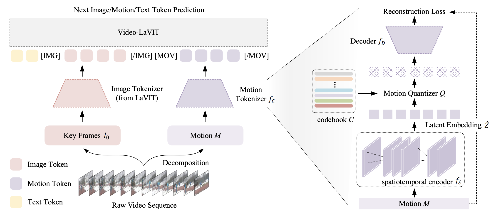

# LaVIT: Empower the Large Language Model to Understand and Generate Visual Content

This is the official repository for the multi-modal large language models: **LaVIT** and **Video-LaVIT**. The LaVIT project aims to leverage the exceptional capability of LLM to deal with visual content. The proposed pre-training strategy supports visual understanding and generation with one unified framework. You can find more examples in our [Project](https://video-lavit.github.io) website.

* Unified Language-Vision Pretraining in LLM with Dynamic Discrete Visual Tokenization, ICLR 2024, [[`arXiv`](https://arxiv.org/abs/2309.04669)] [[`BibTeX`](#Citing)]

* Video-LaVIT: Unified Video-Language Pre-training with Decoupled Visual-Motional Tokenization, [[`arXiv`](https://arxiv.org/abs/2402.03161)] [[`Project`](https://video-lavit.github.io)] [[`BibTeX`](#Citing)]


## News and Updates

* ```2024.04.21``` 🚀🚀🚀 We have released the pre-trained weight for **Video-LaVIT** on the HuggingFace and provide the inference code.

* ```2024.02.05``` 🌟🌟🌟  We have proposed the **Video-LaVIT**: an effective multimodal pre-training approach that empowers LLMs to comprehend and generate video content in a unified framework.

* ```2024.01.15``` 👏👏👏 LaVIT has been accepted by ICLR 2024!

* ```2023.10.17``` 🚀🚀🚀  We release the pre-trained weight for **LaVIT** on the HuggingFace and provide the inference code of using it for both multi-modal understanding and generation.


## Introduction
The **LaVIT** and **Video-LaVIT** are general-purpose multi-modal foundation models that inherit the successful learning paradigm of LLM: predicting the next visual/textual token in an auto-regressive manner. The core design of the LaVIT series works includes a **visual tokenizer** and a **detokenizer**. The visual tokenizer aims to translate the non-linguistic visual content (e.g., image, video) into a sequence of discrete tokens like a foreign language that LLM can read. The detokenizer recovers the generated discrete tokens from LLM to the continuous visual signals.

<div align="center">
  
</div><br/>


<div align="center">
  LaVIT Pipeline
</div><br/>

<div align="center">
  
</div><br/>

<div align="center">
  Video-LaVIT Pipeline
</div><br/>

After pre-training, LaVIT and Video-LaVIT can support

* Read image and video content, generate the captions, and answer the questions.
* Text-to-image, Text-to-Video and Image-to-Video generation.
* Generation via Multi-modal Prompt.

## <a name="Citing"></a>Citation
Consider giving this repository a star and cite LaVIT in your publications if it helps your research.

```
@article{jin2023unified,
  title={Unified Language-Vision Pretraining in LLM with Dynamic Discrete Visual Tokenization},
  author={Jin, Yang and Xu, Kun and Xu, Kun and Chen, Liwei and Liao, Chao and Tan, Jianchao and Mu, Yadong and others},
  journal={arXiv preprint arXiv:2309.04669},
  year={2023}
}

@article{jin2024video,
  title={Video-LaVIT: Unified Video-Language Pre-training with Decoupled Visual-Motional Tokenization},
  author={Jin, Yang and Sun, Zhicheng and Xu, Kun and Chen, Liwei and Jiang, Hao and Huang, Quzhe and Song, Chengru and Liu, Yuliang and Zhang, Di and Song, Yang and others},
  journal={arXiv preprint arXiv:2402.03161},
  year={2024}
}