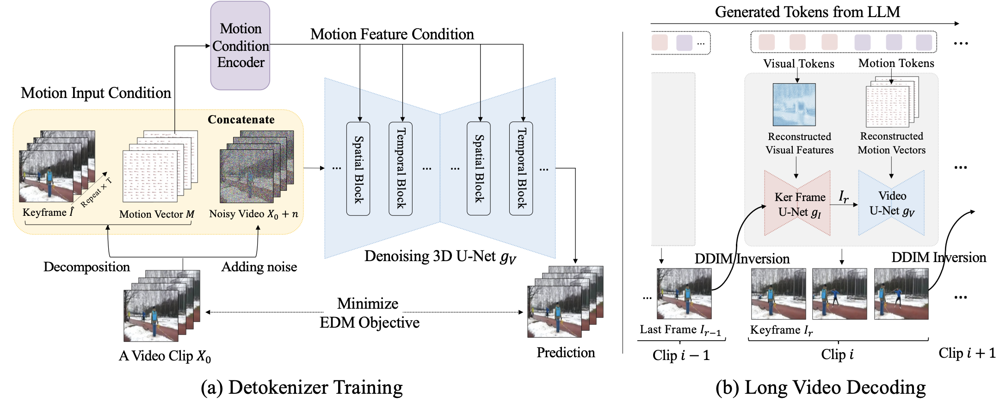

# ICML 2024 Oral: Video-LaVIT: Unified Video-Language Pre-training with Decoupled Visual-Motional Tokenization

[[`arXiv`](https://arxiv.org/abs/2402.03161)] [[`Project`](https://video-lavit.github.io)] [[`BibTeX`](#Citing)]

This is the official repository for **Video-LaVIT**: a multi-modal large language model capable of both comprehending and generating videos, based on an efficient decomposed video representation.

## News and Updates

* ```2024.04.15``` 🚀🚀🚀 We have released the pre-trained weight of **Video-LaVIT** v1.0 on the HuggingFace and provide the inference code. This is the initial version, trained only on the open-sourced WebVid-10M. 

* ```2024.02.05``` 🌟🌟🌟  We have released the paper of **Video-LaVIT**.


## Future Schedules

Now, Video-LaVIT is only trained on the open-sourced dataset: WebVid-10M, where the videos are low resolution (320p) and have watermarks. Due to these data constraints, the current version has a chance of generating videos with watermarks. We will continue to optimize the video generation performance by using more video training data without watermarks in the future. Stay tuned for this repository! 

- [ ] Further improve the video generation performance using watermark-free training videos.
- [ ] Further improve the long video generation performance.
- [ ] The sft finetuning code for Video-LaVIT
- [ ] The evaluation code.


## Introduction
**Video-LaVIT** is a video-language model using an efficient video decomposition that represents each video as keyframes and temporal motions. Both them are then adapted to an LLM using well-designed tokenizers that discretize visual and temporal information as a few tokens, thus enabling unified generative pre-training of videos, images, and text. At inference, the generated tokens from the LLM are carefully recovered to the original continuous pixel space by a video detokenizer to create various video content. **Video-LaVIT** is both capable of comprehending and generating image and video content. It achieves competitive performance across 13 multimodal benchmarks in image and video understanding and generation. For more technical details, please refer to our [paper](https://arxiv.org/abs/2402.03161).

<div align="center">
  
</div><br/>

<div align="center">
  Video-LaVIT Pipeline
</div><br/>

<div align="center">
  
</div><br/>

<div align="center">
  The Proposed Video Detokenizer
</div><br/>

## Capabilities

**Video-LaVIT** has a lot of generation and understanding capabilities:

### 1. Understanding the Image and Video Content
Video-LaVIT can comprehend the visual content and answer various questions. It supports both the image and video understanding.

### 2. Text-to-video Generation
Given the text prompts, it can generate various high-resolution video content:

<table class="center">
  <td><a></td>
  <td><a></td>
  <td><a></td>
  <tr>
  <td style="text-align:center;" width="320">"Sailboat sailing on a sunny day in a mountain lake"</td>
  <td style="text-align:center;" width="320">"Waves crashing against a lone lighthouse, ominous lighting"</td>
  <td style="text-align:center;" width="320">"A steaming cup of coffee with mountains in the background. Resting during road trip"</td>
  <tr>
</table >

### 3. Image-to-video Generation
Since all modalities are represented as the unified discrete format during pre-training, Video-LaVIT seamlessly supports the image-to-video generation.

<table class="center">
  <td></td>
  <td></td>
  <td></td>
  <tr>
  <td><a></td>
  <td><a></td>
  <td><a></td>
</table >


### 4. Long Video Generation. 
Since video is inherently a time series, this autoregressive pre-training of Video-LaVIT contributes to learning the sequential relationships of different video clips. Due to the limitations of displaying on GitHub, you can find more examples on the project page.


## Setup

### Requirements

The code for this repo is tested with PyTorch 1.13.1 and CUDA 11.7.
You should first install and configure the Pytorch Environment (including torch and torchvision) can then install the requirements with the following commands:

```shell
git clone https://github.com/jy0205/LaVIT.git
cd VideoLaVIT
pip install -r requirements.txt
```

**Video-LaVIT** uses this [tool](https://github.com/LukasBommes/mv-extractor) to extract motion vectors. You need to install [FFMPEG](https://ffmpeg.org/download.html) to support re-encodeing video with MPEG 4 Part 2 codec.


* (Important) Since video generation is memory cost, we recommend using memory efficient attention by installing xFormers following the instructions in [here](https://huggingface.co/docs/diffusers/main/en/optimization/xformers). Then, you can set the argument `use_xformers=True` in `build_model` function  to save the GPU memory and speed up inference.


### Model Zoo

We now release the Video-LaVIT v1.0. It is trained only on the open-sourced dataset: WebVid-10M, where the videos are low resolution (320p) and have watermarks. The weights after SFT are stored in the `language_model_sft` folder, which is used for multimodal content understanding. The weight of our video detokenizer is also released for academic research, which can accurately recover the video content based on one keyframe and its subsequent motion vectors.

|Model Name|Checkpoints|
|:---------|:--------|
|Video-LaVIT-v1|[Hugging Face](https://huggingface.co/rain1011/Video-LaVIT-v1/tree/main)
|Video-LaVIT-v1-sft|[Hugging Face](https://huggingface.co/rain1011/Video-LaVIT-v1/tree/main/language_model_sft)
|Video Detokenizer|[Hugging Face](https://huggingface.co/rain1011/Video-LaVIT-v1/blob/main/video_3d_unet.bin)


### Download the Pre-trained Checkpoint
Before usage, you need to download the pre-trained checkpoint through the Huggingface hub:

```python
from huggingface_hub import snapshot_download

model_path = 'PATH'   # The local directory to save Video-LaVIT checkpoint
snapshot_download("rain1011/Video-LaVIT-v1", local_dir=model_path, local_dir_use_symlinks=False, repo_type='model')
```

* (Optional) Due to the watermarks and low resolution of webvid-10M, the current version of VideoLaVIT has a chance of generating videos with watermarks. To generate video without a watermark, we propose to manually intervene the keyframe tokens by a text-to-image model. We use the Playground-v2 here and you need to download the weights from the [this](https://huggingface.co/playgroundai/playground-v2-1024px-aesthetic/blob/main/playground-v2.fp16.safetensors).

  ```python
  from huggingface_hub import hf_hub_download
  
  model_path = 'PATH'   # The local directory to save playground v2 checkpoint
  snapshot_download("playgroundai/playground-v2-1024px-aesthetic", local_dir=model_path, local_dir_use_symlinks=False, repo_type='model')
  ```


## Usage

Only a few lines of code are needed to use **Video-LaVIT** for inference. We have provided detailed examples in the following jupyter notebooks for learning how to interact with Video-LaVIT. 


* `understanding.ipynb` : examples for multi-modal understanding, including both image and video understanding.
* `generation.ipynb`: examples for the video generation, including text-to-video, image-to-video, and long video generation (takes a lot of time).
* `video_reconstruction.ipynb`: examples for showing the effectiveness of our video tokenizer, it reconstruct the original video based on one keyframe + motion vectors.
* `video_generation_aest.ipynb`: examples for text-to-video generation with keyframe intervention, which contributes to generating videos without watermarks.


## Acknowledgement
We are grateful for the following awesome projects when implementing LaVIT:
* [LLaMA](https://github.com/facebookresearch/llama): Open and Efficient Foundation Language Models
* [EVA-CLIP](https://github.com/baaivision/EVA/tree/master/EVA-CLIP): Improved Training Techniques for CLIP at Scale
* [BEIT](https://github.com/microsoft/unilm/tree/master/beit2): Masked Image Modeling with Vector-Quantized Visual Tokenizers
* [Diffusers](https://github.com/huggingface/diffusers): State-of-the-art diffusion models for image and audio generation in PyTorch.
* [LAVIS](https://github.com/salesforce/LAVIS): A One-stop Library for Language-Vision Intelligence


## <a name="Citing"></a>Citation
Consider giving this repository a star and cite Video-LaVIT in your publications if it helps your research.

```
@inproceedings{jin2024video,
  title={Video-LaVIT: Unified Video-Language Pre-training with Decoupled Visual-Motional Tokenization},
  author={Jin, Yang and Sun, Zhicheng and Xu, Kun and Chen, Liwei and Jiang, Hao and Huang, Quzhe and Song, Chengru and Liu, Yuliang and Zhang, Di and Song, Yang and Gai, Kun and Mu, Yadong},
  booktitle={International Conference on Machine Learning},
  pages={22185--22209},
  year={2024}
}